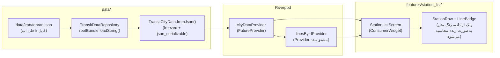

<div align="center">


# اوپن‌ترنسپورت (OpenTransport)

**یک اپلیکیشن حمل‌ونقل عمومی، متن‌باز و آفلاین-محور — ساخته‌شده توسط جامعه، برای هر شهری که مترو، اتوبوس یا تراموا دارد.**

شروع با سیستم مترو ایران. از ابتدا طوری طراحی شده که بشود بعداً اتوبوس، تراموا و BRT را هم اضافه کرد — برای هر کشور، به هر زبانی.

[](LICENSE)
[](https://github.com/ArastooYsf/OpenTransport/actions/workflows/ci.yml)
[](CONTRIBUTING.md)
[](https://flutter.dev)
[](https://claude.com/claude-code)

**[English](README.md)** · [بحث و گفتگو](https://github.com/ArastooYsf/OpenTransport/discussions) · [راهنمای مشارکت](CONTRIBUTING.md) · [گزارش باگ](https://github.com/ArastooYsf/OpenTransport/issues/new/choose)

</div>

---

> این فایل ترجمه فارسی `README.md` است. در صورت هرگونه تناقض، نسخه انگلیسی
> مرجع اصلی محسوب می‌شود (چون کد و کامنت‌های پروژه به انگلیسی نوشته شده‌اند)،
> اما تلاش می‌شود این دو فایل هم‌زمان به‌روزرسانی شوند.

## فهرست مطالب

- [چرا اوپن‌ترنسپورت؟](#چرا-اوپن‌ترنسپورت)
- [امکانات](#امکانات)
- [نحوهٔ کار اپ](#نحوهٔ-کار-اپ)
  - [پشت صحنه: زمان اجرا](#پشت-صحنه-زمان-اجرا)
  - [پشت صحنه: داده‌ها چطور وارد می‌شوند](#پشت-صحنه-داده‌ها-چطور-وارد-می‌شوند)
- [مدل داده](#مدل-داده)
- [پشتهٔ فناوری (Tech Stack)](#پشتهٔ-فناوری-tech-stack)
- [ساختار پروژه](#ساختار-پروژه)
- [شروع به کار](#شروع-به-کار)
- [افزودن یک زبان جدید](#افزودن-یک-زبان-جدید)
- [چطور کمک کنیم؟](#چطور-کمک-کنیم)
- [نقشهٔ راه](#نقشهٔ-راه)
- [درخواست کمک و پشتیبانی](#درخواست-کمک-و-پشتیبانی)
- [دربارهٔ کدبیس — ساخته‌شده با Claude Code](#دربارهٔ-کدبیس--ساخته‌شده-با-claude-code)
- [مجوز (License)](#مجوز-license)
- [تشکر و منابع](#تشکر-و-منابع)

---

## چرا اوپن‌ترنسپورت؟

ساخت یک اپ خوب برای حمل‌ونقل عمومی، هم گران است و هم نگه‌داشتنش به‌روز
هزینه دارد — به همین دلیل اکثر شهرهای دنیا یا اصلاً چنین اپی ندارند، یا اپی
دارند که رهاشده، پر از تبلیغ، یا فقط به یک زبان است. در همین حال، کسانی که
واقعاً سیستم حمل‌ونقل یک شهر را بهتر از همه می‌شناسند، همان کسانی هستند که
هرروز با آن رفت‌وآمد می‌کنند.

اوپن‌ترنسپورت تلاشی است برای حل این مشکل با همان الگویی که
[OpenStreetMap](https://www.openstreetmap.org) را موفق کرد: یک اپ کوچک و
صادق، به‌علاوهٔ داده‌ای که هرکسی می‌تواند به آن کمک کند، اصلاحش کند و دوباره
راستی‌آزمایی‌اش کند — همه به‌صورت باز و نسخه‌بندی‌شده، در قالب یک شِما
(schema) که هم به‌اندازهٔ کافی دقیق است تا قابل‌اتکا بماند، و هم به‌اندازهٔ
کافی ساده است که یک فرد غیربرنامه‌نویس هم بتواند آن را بخواند و ویرایش کند.

شروع کار از **سیستم‌های مترو ایران** است، چون همان‌جایی است که سازندهٔ اول
پروژه زندگی می‌کند و می‌تواند شخصاً داده‌ها را راستی‌آزمایی کند — اما خودِ اپ،
شِمای داده، و کل معماری از روز اول عمداً به‌شکلی عمومی و مستقل از یک شهر
خاص طراحی شده‌اند، تا اضافه‌کردن شهر شما هم یک Pull Request باشد، نه یک
بازنویسی از صفر.

## امکانات

**همین حالا:**

- آفلاین-محور: اپ همراه با داده‌های حمل‌ونقل داخلش عرضه می‌شود، پس بدون
  اینترنت، بدون نیاز به حساب کاربری و بدون تبلیغات کار می‌کند.
- لیست ایستگاه‌ها با رنگ واقعی و رسمی هر خط، و رنگ متنی که به‌صورت خودکار
  برای *هر* رنگ خطی محاسبه می‌شود تا همیشه خوانا بماند (به [design.md](design.md) نگاه کنید).
- پشتیبانی کامل از راست‌به‌چپ (فارسی) و چپ‌به‌راست (انگلیسی)، از همان اولین
  صفحه — نه چیزی که بعداً اضافه شده باشد.
- یک فرمت داده برای حمل‌ونقل ([`schema.json`](schema.json)) که به‌اندازهٔ
  کافی عمومی است تا بتواند مترو، اتوبوس، تراموا یا BRT را توصیف کند، به
  سبک GTFS.

**در آینده** (به [نقشهٔ راه](#نقشهٔ-راه) نگاه کنید):

- نقشهٔ تعاملی با ترسیم زندهٔ خطوط و نشانگر ایستگاه‌ها.
- مسیریابی (از مبدأ تا مقصد، همراه با تعویض خط).
- انیمیشنی شبیه به موقعیت زندهٔ قطار روی مسیر.
- یکپارچگی با دستیار صوتی (Siri Shortcuts / Google Assistant App Actions) —
  لایهٔ `assistant/` از هم‌اکنون به‌عنوان یک رابط پایدار برای این کار وجود
  دارد و منتظر پیاده‌سازی است.
- یک مانیفست ریموت برای دریافت به‌روزرسانی‌های داده بدون نیاز به انتشار
  نسخهٔ جدید در اپ‌استور، درحالی‌که همیشه یک نسخهٔ کاملاً آفلاین به‌عنوان
  پشتیبان (fallback) باقی می‌ماند.

## نحوهٔ کار اپ

اوپن‌ترنسپورت یک اپ Flutter با یک کدبیس مشترک است (اندروید + iOS)، با
جداسازی دقیق بین چهار لایه:

```
core/        ابزارهای سیستم طراحی، تم، و توابع کمکی مشترک.
             هیچ منطق کسب‌وکاری اینجا نیست — فقط چیزهایی که هر فیچر می‌تواند
             دوباره استفاده کند (مثلاً محاسبهٔ رنگ متنِ خوانا برای بج یک خط).

data/        تنها لایه‌ای که اجازه دارد به storage/JSON/شبکه دسترسی داشته باشد.
             Repository ها مدل‌های تایپ‌شدهٔ Dart را در اختیار بقیهٔ اپ
             می‌گذارند؛ هیچ لایهٔ بالاتری هیچ‌وقت مستقیماً JSON خام را
             پارس یا یک فایل را نمی‌خواند.

features/    یک پوشه به‌ازای هر صفحه/فیچر، کاملاً مستقل: widget های خودش،
             provider های Riverpod خودش، و در صورت نیاز مدل‌های خودش.
             فیچرها هیچ‌وقت مستقیماً از هم import نمی‌کنند — از طریق
             core/ یا data/ باهم به اشتراک می‌گذارند.

assistant/   یک رابط نازک و پایدار برای یکپارچگی صوتی/هوش‌مصنوعی در آینده
             (مثلاً «یک مسیر پیدا کن»، «قطار بعدی کِی می‌آید») — عمداً هنوز
             به هیچ SDK واقعی هوش‌مصنوعی/صوتی وصل نشده، تا کد فیچرها بتواند
             از همین امروز روی یک قرارداد پایدار ساخته شود.
```

### پشت صحنه: زمان اجرا

این‌جا دقیقاً چه اتفاقی بین باز شدن اپ تا نمایش یک ایستگاه روی صفحه
می‌افتد:



هیچ‌کدام از لایه‌های بالاتر از `data/` هیچ‌وقت مستقیماً با `rootBundle`،
مسیر یک فایل، یا JSON خام کار نمی‌کنند — یک widget فقط از یک provider در
Riverpod داده‌ی تایپ‌شده می‌خواهد، و یک provider هم فقط از یک repository.
این همان چیزی است که [`CLAUDE.md`](CLAUDE.md) با عبارت «UI هیچ‌وقت
مستقیماً با storage/شبکه صحبت نمی‌کند» می‌گوید: این یک سلیقهٔ سبکی نیست،
بلکه دقیقاً همان چیزی است که بعداً امکان جایگزینی «خواندن یک فایل داخلی»
با «چک‌کردن یک مانیفست ریموت، و در صورت نبود اینترنت بازگشت به فایل
داخلی» را بدون دست‌زدن به حتی یک widget فراهم می‌کند.

اپ از همان لحظهٔ طراحی «آفلاین-اول» است، نه به‌طور تصادفی: امروز، تنها منبع
داده همان فایل داخلی است. وقتی همگام‌سازی ریموت بعداً اضافه شود
(`data/remote/`)، *رابط* repository تغییر نمی‌کند — صفحات همچنان با همان
`TransitDataRepository` صحبت می‌کنند، پس اپ هیچ‌وقت به‌طور اتفاقی به یک
وابستگی اجباری به اینترنت دچار نمی‌شود.

### پشت صحنه: داده‌ها چطور وارد می‌شوند

نیمهٔ دیگر «نحوهٔ کار اپ» این است که داده‌های حمل‌ونقل یک شهر چطور از دانش
یک مشارکت‌کننده به داخل اپ راه پیدا می‌کنند:


این pipeline عمداً چه مشارکت‌کننده یک توسعه‌دهندهٔ Flutter باشد چه کسی که
تابه‌حال کدی ننوشته، **یکسان** است — کل فلسفهٔ داشتن یک JSON schema دقیق و
مستند این است که «اضافه‌کردن خط ۲ متروی تهران» و «بازطراحی سیستم تم» هردو
بتوانند Pull Request باشند، توسط دو نوع متخصص متفاوت بازبینی شوند، بدون
اینکه هیچ‌کدام مانع دیگری شود.

## مدل داده

هر شهر یک فایل است: `data/<کد-کشور>/<اسلاگ-شهر>.json`، که در برابر
[`schema.json`](schema.json) (یک JSON Schema با الهام از GTFS) اعتبارسنجی
می‌شود. یک مثال کوتاه‌شده، با یک خط و یک ایستگاه:

```json
{
  "meta": {
    "country": "IR",
    "city": "tehran",
    "dataVersion": "0.1.0",
    "lastUpdated": "2026-09-06",
    "source": [{ "type": "official_gtfs", "url": "https://example.org/gtfs" }]
  },
  "lines": [
    {
      "id": "tehran-line-1",
      "name": { "fa": "خط ۱ متروی تهران", "en": "Tehran Metro Line 1" },
      "shortName": "1",
      "color": "#ED1C24",
      "transportType": "metro",
      "stationIds": ["tehran-tajrish"]
    }
  ],
  "stations": [
    {
      "id": "tehran-tajrish",
      "name": { "fa": "تجریش", "en": "Tajrish" },
      "lat": 35.8044,
      "lng": 51.4319,
      "lineIds": ["tehran-line-1"],
      "accessibility": { "elevator": true, "ramp": true }
    }
  ],
  "calendar": [],
  "trips": [],
  "stopTimes": []
}
```

چند تصمیم طراحی عمدی که ارزش دانستن دارند:

- **`transportType` عمداً عمومی است** (`metro`, `bus`, `tram`, `brt`,
  `commuter_rail`, `other`) — این شِما طوری نوشته شده که بعداً بشود اتوبوس/
  تراموا/BRT را بدون یک تغییر شکنندهٔ (breaking) اضافه کرد.
- **اسم‌ها یک نگاشت (map) بین زبان‌ها هستند، نه یک رشتهٔ ساده**
  (`{ "fa": "...", "en": "..." }`)، چون اسم یک ایستگاه فقط یک رشته نیست —
  یک واقعیت است که در هر زبانی که مسافرانش صحبت می‌کنند، وجود دارد.
- **`calendar`/`trips`/`stopTimes` از GTFS الگو گرفته‌اند** (الگوهای
  سرویس، سفرها، و زمان توقف در هر ایستگاه) — برای هرکسی که قبلاً با داده‌های
  حمل‌ونقل کار کرده آشناست، و طوری ساخته شده که فیدهای واقعی GTFS بتوانند
  در آینده به این فرمت تبدیل شوند.
- **رنگ‌ها داده هستند، نه کد.** هیچ رنگ خطی هیچ‌وقت در Dart هاردکد
  (hardcode) نمی‌شود — به سیستم رنگ در `design.md` و فایل‌های
  `lib/core/utils/hex_color.dart` و `contrast_color.dart` نگاه کنید.

مستندات کامل فیلد به فیلد در خودِ فایل schema قرار دارد — تقریباً هر فیلد
در `schema.json` یک `description` دارد.

## پشتهٔ فناوری (Tech Stack)

| لایه | انتخاب | چرا |
|---|---|---|
| فریم‌ورک | [Flutter](https://flutter.dev) | یک کدبیس مشترک برای اندروید و iOS. |
| مدیریت state | [Riverpod](https://riverpod.dev) | ایمن در زمان کامپایل، قابل تست، بدون وابستگی منطق کسب‌وکار به `BuildContext`. |
| مدل‌های داده | [freezed](https://pub.dev/packages/freezed) + [json_serializable](https://pub.dev/packages/json_serializable) | مدل‌های immutable با `copyWith`/equality تولیدشده (سازگار با Riverpod) *و* تبدیل خودکار به/از JSON — دلیل انتخاب در کامنت‌های کد `lib/data/models/` توضیح داده شده. |
| ذخیره‌سازی/کش محلی | [Hive](https://pub.dev/packages/hive) (برنامه‌ریزی‌شده) | سبک، بدون وابستگی native، مناسب برای کش آفلاین داده‌های حمل‌ونقل. |
| شبکه | [Dio](https://pub.dev/packages/dio) (برنامه‌ریزی‌شده، در `data/remote/`) | برای چک‌کردن آیندهٔ مانیفست به‌روزرسانی — پشت لایهٔ repository ایزوله شده تا هیچ‌وقت یک وابستگی اجباری نشود. |
| بین‌المللی‌سازی (i18n) | `flutter_localizations` + فایل‌های ARB | چندزبانگی و پشتیبانی راست‌به‌چپ/چپ‌به‌راست از روز اول — به [افزودن یک زبان جدید](#افزودن-یک-زبان-جدید) نگاه کنید. |
| اعتبارسنجی داده | [jsonschema](https://python-jsonschema.readthedocs.io) (پایتون، در CI و `scripts/validate_data.py`) | هر فایل داده‌ای که مشارکت‌کنندگان اضافه می‌کنند را در برابر `schema.json` صادق نگه می‌دارد. |

## ساختار پروژه

```
OpenTransport/
├── CLAUDE.md              قوانین معماری — منبع اصلی برای نحوهٔ سازمان‌دهی این ریپو
├── design.md              سیستم طراحی بصری — هر تصمیم UI باید به این‌جا برگردد
├── schema.json            قرارداد داده‌های حمل‌ونقل
├── scripts/
│   └── validate_data.py   هر data/<country>/<city>.json را در برابر schema.json چک می‌کند
├── data/
│   └── iran/
│       └── tehran.json    نمونه دیتاست داخلی اپ
├── lib/
│   ├── core/              تم، ابزارهای کنتراست/لوکالایز — مشترک، بدون منطق کسب‌وکاری
│   ├── data/
│   │   ├── models/        مدل‌های داده freezed + json_serializable (منطبق بر schema.json)
│   │   ├── repositories/  TransitDataRepository — تنها چیزی که اجازهٔ خواندن داده خام دارد
│   │   └── providers/     provider های Riverpod برای state مشترک لایهٔ داده
│   ├── features/
│   │   └── station_list/  کاملاً مستقل: widgets/، providers/، screens/
│   ├── assistant/         رابط پایدار برای یکپارچگی صوتی/هوش‌مصنوعی در آینده
│   └── l10n/              فایل‌های منبع ARB + کلاس‌های لوکالایزیشن تولیدشده
└── test/                  تست‌های unit و widget (منطبق با ساختار lib/)
```

## شروع به کار

**پیش‌نیازها:** [Flutter](https://docs.flutter.dev/get-started/install)
نسخهٔ ۳.۴۴ به بالا (کانال stable) — دستور `flutter doctor` را اجرا کنید و
مطمئن شوید Android Studio (برای اندروید) و/یا Xcode (برای iOS) برای پلتفرم
موردنظرتان آماده هستند.

```bash
git clone https://github.com/ArastooYsf/OpenTransport.git
cd OpenTransport

flutter pub get

# ساخت کلاس‌های لوکالایزیشن از روی lib/l10n/*.arb
flutter gen-l10n

# ساخت مدل‌های داده freezed/json_serializable
dart run build_runner build --delete-conflicting-outputs

# اجرای اپ
flutter run
```

پیش از هر commit، این دستورات را اجرا کنید:

```bash
dart format lib/ test/ --set-exit-if-changed
flutter analyze
flutter test
```

اگر چیزی در `data/` تغییر داده‌اید، این را هم اجرا کنید:

```bash
python3 scripts/validate_data.py
```

همهٔ این‌ها به‌صورت خودکار در CI روی هر Pull Request اجرا می‌شوند (به
[`.github/workflows/ci.yml`](.github/workflows/ci.yml) نگاه کنید).

## افزودن یک زبان جدید

این اپ از روز اول برای چندزبانه‌بودن ساخته شده — فارسی و انگلیسی نقطهٔ
شروع هستند، نه سقف پروژه. برای افزودن یک ترجمهٔ رابط کاربری:

۱. فایل `lib/l10n/app_en.arb` را در `lib/l10n/app_<کد-زبان>.arb` کپی کنید.

۲. هر مقدار را ترجمه کنید (کلیدهای متادیتای شروع‌شده با `@` را همان‌طور
نگه دارید).

۳. با اجرای دوبارهٔ `flutter gen-l10n`، زبان جدید به‌طور خودکار به
`AppLocalizations.supportedLocales` اضافه می‌شود — این دستور هر فایل
`app_*.arb` را در `lib/l10n/` خودش پیدا می‌کند.

۴. مطمئن شوید زبان جدید درست رندر می‌شود، به‌خصوص اگر راست‌به‌چپ است — به
الگوی تست در
`test/features/station_list/station_list_screen_test.dart` نگاه کنید که
هر دو جهت را چک می‌کند.

اسم ایستگاه‌ها و خطوط جدا، و به‌ازای هر دیتاست، در نگاشت‌های `name` هر فایل
`data/<country>/<city>.json` ترجمه می‌شوند — به [مدل داده](#مدل-داده) و
[مشارکت در داده‌های حمل‌ونقل](CONTRIBUTING.md#contributing-transit-data-no-coding-required)
نگاه کنید.

می‌خواهید همین README را به زبان دیگری ترجمه کنید؟ به بخش
[چطور کمک کنیم؟](#چطور-کمک-کنیم) نگاه کنید.

## چطور کمک کنیم؟

برای مشارکت معنادار، لازم نیست بلد باشید کد بنویسید. سه راه اصلی برای
کمک‌کردن وجود دارد:

۱. **اضافه یا اصلاح داده‌های حمل‌ونقل** — پرتأثیرترین و کم‌مانع‌ترین راه
کمک. اگر سیستم مترو/اتوبوس/تراموای یک شهر را می‌شناسید، یا چیزی اشتباه
دیدید، یک
[ایشوی داده](https://github.com/ArastooYsf/OpenTransport/issues/new?template=new_transit_data.yml)
یا یک Pull Request باز کنید. راهنمای کامل:
[CONTRIBUTING.md بخش «Contributing transit data»](CONTRIBUTING.md#contributing-transit-data-no-coding-required).

۲. **مشارکت در کد** — Flutter/Dart، از یک اصلاح کوچک UI تا موتور نقشه/
مسیریابی. راهنمای کامل:
[CONTRIBUTING.md بخش «Contributing code»](CONTRIBUTING.md#contributing-code).

۳. **ترجمه** — رابط کاربری اپ (فایل‌های ARB) یا همین README را به زبان
خودتان ترجمه کنید. یک Pull Request باز کنید، یا اگر می‌خواهید یک
`README.<lang>.md` جدید شروع کنید و برای هماهنگی با ساختار موجود کمک
می‌خواهید، در
[بحث و گفتگو (Discussions)](https://github.com/ArastooYsf/OpenTransport/discussions)
بپرسید.

هرکدام از این‌ها در نهایت یک issue یا یک Pull Request می‌شود — وقتی یکی
باز می‌کنید، به قالب‌های زیر پوشهٔ `.github/ISSUE_TEMPLATE/` نگاه کنید؛ آن‌ها
شما را راهنمایی می‌کنند که چه چیزی مفید است بنویسید.

## نقشهٔ راه

- [x] اسکلت پروژه: معماری، Riverpod، بین‌المللی‌سازی (fa/en)، pipeline
      داده‌ی تایپ‌شده، اولین صفحه (لیست ایستگاه‌ها با بج رنگ خط).
- [ ] نقشهٔ تعاملی با خطوط ترسیم‌شده و نشانگر ایستگاه‌ها.
- [ ] مسیریابی (مبدأ ← مقصد، تعویض خط، مدت‌زمان).
- [ ] انیمیشن شبیه به موقعیت زندهٔ قطار.
- [ ] گسترش پوشش داده: شهرهای بیشتر ایران، سپس اتوبوس/تراموا/BRT.
- [ ] مانیفست به‌روزرسانی ریموت، با بستهٔ آفلاین به‌عنوان یک fallback دائمی.
- [ ] یکپارچگی دستیار صوتی (Siri Shortcuts، Google Assistant App Actions)
      از طریق لایهٔ `assistant/`.
- [ ] گسترش فراتر از ایران، هرچه مشارکت‌کنندگان داده‌ی شهر خودشان را
      بیاورند.

پیشرفت پروژه و بحث دربارهٔ اولویت‌ها را در
[Discussions](https://github.com/ArastooYsf/OpenTransport/discussions) و
[Issues](https://github.com/ArastooYsf/OpenTransport/issues) دنبال کنید.

## درخواست کمک و پشتیبانی

- **سؤال، ایده، «چطور می‌شود...»:**
  [GitHub Discussions](https://github.com/ArastooYsf/OpenTransport/discussions).
- **باگ قابل‌بازتولید:**
  [یک گزارش باگ باز کنید](https://github.com/ArastooYsf/OpenTransport/issues/new?template=bug_report.yml).
- **ایدهٔ یک قابلیت جدید:**
  [یک درخواست قابلیت باز کنید](https://github.com/ArastooYsf/OpenTransport/issues/new?template=feature_request.yml).
- **داده‌ی حمل‌ونقل ناقص یا اشتباه:**
  [یک ایشوی داده باز کنید](https://github.com/ArastooYsf/OpenTransport/issues/new?template=new_transit_data.yml).
- **مسئلهٔ امنیتی:** لطفاً از یک issue عمومی استفاده نکنید — به
  [SECURITY.md](SECURITY.md) نگاه کنید.
- **استانداردهای جامعه:** به [CODE_OF_CONDUCT.md](CODE_OF_CONDUCT.md) نگاه
  کنید.

## دربارهٔ کدبیس — ساخته‌شده با Claude Code

در راستای شفافیت کامل: اسکلت اولیهٔ این پروژه — ساختار پوشه‌ها، راه‌اندازی
Riverpod/i18n/لایهٔ داده، دیتاست نمونهٔ تهران، و اولین صفحه — با کمک
[Claude Code](https://claude.com/claude-code)، ایجنت کدنویسی هوش‌مصنوعی
شرکت Anthropic ساخته شده است، بر اساس یک مشخصات دقیق و دستی
(`CLAUDE.md`، `design.md`، `schema.json`) که معماری، سیستم طراحی، و فرمت
داده را دقیقاً تعریف می‌کند. هر تغییر تولیدشده پیش از نگه‌داشتن، توسط یک
انسان بازبینی شده است.

این فقط یک جزئیات یک‌بارهٔ راه‌اندازی نیست — `CLAUDE.md` برای همیشه در
ریپو باقی می‌ماند به‌عنوان قرارداد معماری پروژه، دقیقاً به همین دلیل که هم
مشارکت‌کنندگان انسانی *و هم* دستیارهای کدنویسی هوش‌مصنوعی، همان‌طور که
پروژه رشد می‌کند، از قوانین یکسانی پیروی کنند. اگر خودتان از یک دستیار
کدنویسی هوش‌مصنوعی استفاده می‌کنید، خواندن `CLAUDE.md` و `design.md` پیش
از هر کاری، سریع‌ترین راه است تا از همان بار اول یک PR بگیرید که با این
کدبیس هم‌خوانی دارد.

## مجوز (License)

کد تحت [مجوز MIT](LICENSE) منتشر شده است.

داده‌های حمل‌ونقل داخل پوشهٔ `data/` از منابع عمومی جمع‌آوری شده‌اند
(OpenStreetMap، فیدهای رسمی GTFS، انتشارات رسمی سازمان‌های حمل‌ونقل، و
بررسی‌های میدانی جامعه — به فیلد `meta.source` هر فایل نگاه کنید). اگر
قصد استفاده از خودِ داده در جای دیگری را دارید، لطفاً مجوز/شرایط منبع
ذکرشده برای آن فایل خاص را هم بررسی کنید.

## تشکر و منابع

- [OpenStreetMap](https://www.openstreetmap.org) و مشارکت‌کنندگانش — الگویی
  که رویکرد مشارکت در داده‌های این پروژه از آن الهام گرفته، و یکی از منابع
  اصلی برای موقعیت ایستگاه‌ها و هندسهٔ خطوط.
- [GTFS (General Transit Feed Specification)](https://gtfs.org) — ساختار
  `calendar`/`trips`/`stopTimes` در `schema.json` عمداً از آن الگو گرفته.
- مستندات [Flutter](https://flutter.dev) و [Riverpod](https://riverpod.dev).
- [وزیرمتن](https://github.com/rastikerdar/vazirmatn) و
  [Inter](https://rsms.me/inter/) — فونت‌های فارسی/عربی و لاتین اپ (به بخش
  Typography در `design.md` نگاه کنید)، هر دو در `assets/fonts/` قرار دارند
  و تحت [SIL Open Font License](https://openfontlicense.org) منتشر شده‌اند
  (فایل‌های `VAZIRMATN_OFL.txt` / `INTER_OFL.txt` را ببینید).
- هر سازمان حمل‌ونقلی که یک فید باز GTFS یا پورتال داده باز منتشر می‌کند —
  منابع رسمی همیشه در اولویت‌اند؛ به
  [مشارکت در داده‌های حمل‌ونقل](CONTRIBUTING.md#contributing-transit-data-no-coding-required)
  نگاه کنید.
- [Claude Code](https://claude.com/claude-code) — برای ساخت اسکلت اولیهٔ
  این پروژه استفاده شده؛ به
  [دربارهٔ کدبیس](#دربارهٔ-کدبیس--ساخته‌شده-با-claude-code) نگاه کنید.
