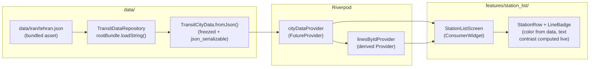
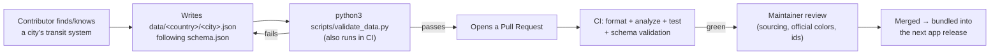

<div align="center">


# OpenTransport

**An open-source, offline-first public transit app — built by the community, for every city that has a bus, a metro, or a tram.**

Starting with Iran's metro systems. Built to grow to bus, tram, and BRT — and to any country, in any language.

[](LICENSE)
[](https://github.com/ArastooYsf/OpenTransport/actions/workflows/ci.yml)
[](CONTRIBUTING.md)
[](https://flutter.dev)
[](https://claude.com/claude-code)

**[فارسی](README.fa.md)** · [Discussions](https://github.com/ArastooYsf/OpenTransport/discussions) · [Contributing](CONTRIBUTING.md) · [Report a bug](https://github.com/ArastooYsf/OpenTransport/issues/new/choose)

</div>

---

## Table of contents

- [Why OpenTransport?](#why-opentransport)
- [Features](#features)
- [How it works](#how-it-works)
  - [Behind the scenes: the runtime](#behind-the-scenes-the-runtime)
  - [Behind the scenes: how data gets in](#behind-the-scenes-how-data-gets-in)
- [The data model](#the-data-model)
- [Tech stack](#tech-stack)
- [Project structure](#project-structure)
- [Getting started](#getting-started)
- [Adding a new language](#adding-a-new-language)
- [How to help](#how-to-help)
- [Roadmap](#roadmap)
- [Getting help](#getting-help)
- [About the codebase — built with Claude Code](#about-the-codebase--built-with-claude-code)
- [License](#license)
- [Acknowledgments & references](#acknowledgments--references)

---

## Why OpenTransport?

Good public transit apps are expensive to build and expensive to keep
up to date — so most cities in the world simply don't have one, or have one
that's abandoned, ad-riddled, or only in one language. Meanwhile, the people
who actually know a city's transit system best are the people who ride it
every day.

OpenTransport is an attempt to fix that with the same model that made
[OpenStreetMap](https://www.openstreetmap.org) work: a small, honest app,
and data that anyone can contribute, fix, and re-verify — versioned in the
open, in a schema strict enough to stay reliable and simple enough that a
non-programmer can read and edit it.

It starts with **Iran's metro systems**, because that's where the first
maintainer lives and can personally verify data — but the app, the data
schema, and the whole architecture are deliberately generic from day one, so
adding your own city is meant to be a pull request, not a rewrite.

## Features

**Today:**

- Offline-first: the app ships with bundled transit data, so it works with
  no internet connection, no accounts, and no ads.
- A station list with real official line colors, and readable text computed
  automatically for *any* line color (see [design.md](design.md)).
- Full right-to-left (Persian) and left-to-right (English) support, built in
  from the first screen — not bolted on later.
- A transit data format ([`schema.json`](schema.json)) generic enough to
  describe metro, bus, tram, or BRT systems, GTFS-style.

**Planned** (see [Roadmap](#roadmap)):

- An interactive map with live line drawing and station markers.
- Route planning (origin → destination, with transfers).
- Live-position-style animation for "where's my train."
- Voice assistant integration (Siri Shortcuts / Google Assistant App
  Actions) — the `assistant/` layer already exists as a stable interface
  for this, waiting to be implemented.
- A remote manifest for pulling data updates without an app-store release,
  while always keeping a fully-offline fallback.

## How it works

OpenTransport is a single-codebase Flutter app (Android + iOS) with a
strict separation between four layers:

```
core/        Design-system utilities, theme, shared helpers.
             No business logic — just things every feature can reuse
             (e.g. computing readable text color for a line badge).

data/        The ONLY layer allowed to touch storage/JSON/network.
             Repositories expose typed Dart models; nothing above this
             layer ever parses raw JSON or reads a file directly.

features/    One folder per screen/feature, self-contained: its own
             widgets, Riverpod providers, and (if needed) models.
             Features never import each other directly — they share
             through core/ or data/.

assistant/   A thin, stable interface for future voice/AI integration
             (e.g. "find a route", "when's the next train") — intentionally
             not wired to any real AI/voice SDK yet, so feature code can be
             built against a stable contract today.
```

### Behind the scenes: the runtime

Here's what actually happens between app launch and a station appearing on
screen:



Nothing above the `data/` layer ever touches `rootBundle`, a file path, or
raw JSON directly — a widget only ever asks a Riverpod provider for typed
data, and a provider only ever asks a repository. This is what
[`CLAUDE.md`](CLAUDE.md) means by "UI never talks to storage/network
directly": it's not a style preference, it's what makes it possible to
later swap "read a bundled file" for "check a remote manifest, then fall
back to the bundled file" without touching a single widget.

The app is offline-first **by construction**, not by accident: today, the
only data source is the bundled asset. When remote sync is added later
(`data/remote/`), the repository's *interface* won't change — screens keep
calling the same `TransitDataRepository`, so the app can never accidentally
grow a hard dependency on network access.

### Behind the scenes: how data gets in

The other half of "how it works" is how a city's transit data gets from a
contributor's knowledge into the app at all:



This is deliberately the *same* pipeline whether the contributor is a
Flutter developer or someone who has never written code before — the whole
point of a strict, documented JSON schema is that "add Tehran's Line 2" and
"refactor the theme system" can both be pull requests, reviewed by
different kinds of experts, without either one blocking the other.

## The data model

Every city is one file: `data/<country-code>/<city-slug>.json`, validated
against [`schema.json`](schema.json) (a GTFS-inspired JSON Schema). A
trimmed example, showing one line and one station:

```json
{
  "meta": {
    "country": "IR",
    "city": "tehran",
    "dataVersion": "0.1.0",
    "lastUpdated": "2026-09-06",
    "source": [{ "type": "official_gtfs", "url": "https://example.org/gtfs" }]
  },
  "lines": [
    {
      "id": "tehran-line-1",
      "name": { "fa": "خط ۱ متروی تهران", "en": "Tehran Metro Line 1" },
      "shortName": "1",
      "color": "#ED1C24",
      "transportType": "metro",
      "stationIds": ["tehran-tajrish"]
    }
  ],
  "stations": [
    {
      "id": "tehran-tajrish",
      "name": { "fa": "تجریش", "en": "Tajrish" },
      "lat": 35.8044,
      "lng": 51.4319,
      "lineIds": ["tehran-line-1"],
      "accessibility": { "elevator": true, "ramp": true }
    }
  ],
  "calendar": [],
  "trips": [],
  "stopTimes": []
}
```

A few deliberate design choices worth knowing:

- **`transportType` is generic on purpose** (`metro`, `bus`, `tram`, `brt`,
  `commuter_rail`, `other`) — the schema was written so bus/tram/BRT can be
  added later without a breaking change.
- **Names are locale maps, not strings** (`{ "fa": "...", "en": "..." }`),
  because a station's name isn't one string — it's a fact that exists in
  every language its riders speak.
- **`calendar`/`trips`/`stopTimes` mirror GTFS** (service patterns, trips,
  per-station stop times) — familiar to anyone who's worked with transit
  data before, and structured so real GTFS feeds can eventually be
  converted into this format.
- **Colors are data, never code.** No line color is ever hardcoded in Dart
  — see `design.md`'s color system and `lib/core/utils/hex_color.dart` /
  `contrast_color.dart`.

Full field-by-field documentation lives in the schema file itself —
`schema.json` includes a `description` on nearly every field.

## Tech stack

| Layer | Choice | Why |
|---|---|---|
| Framework | [Flutter](https://flutter.dev) | Single codebase for Android + iOS. |
| State management | [Riverpod](https://riverpod.dev) | Compile-safe, testable, no `BuildContext` coupling for business logic. |
| Data models | [freezed](https://pub.dev/packages/freezed) + [json_serializable](https://pub.dev/packages/json_serializable) | Immutable models with generated `copyWith`/equality (Riverpod-friendly) *and* generated JSON (de)serialization — see the code comments in `lib/data/models/` for the reasoning. |
| Local storage/cache | [Hive](https://pub.dev/packages/hive) (planned) | Lightweight, no native dependencies, good fit for offline-cached transit data. |
| Networking | [Dio](https://pub.dev/packages/dio) (planned, `data/remote/`) | For the future update-manifest check — isolated behind the repository layer so it's never a hard dependency. |
| i18n | `flutter_localizations` + ARB files | Multi-language and RTL/LTR from day one — see [Adding a new language](#adding-a-new-language). |
| Data validation | [jsonschema](https://python-jsonschema.readthedocs.io) (Python, CI + `scripts/validate_data.py`) | Keeps every contributed data file honest against `schema.json`. |

## Project structure

```
OpenTransport/
├── CLAUDE.md              Architecture rules — the source of truth for how this repo is organized
├── design.md              The visual design system — every UI decision traces back here
├── schema.json            The transit data contract
├── scripts/
│   └── validate_data.py   Validates every data/<country>/<city>.json against schema.json
├── data/
│   └── iran/
│       └── tehran.json    Sample bundled dataset
├── lib/
│   ├── core/              Theme, contrast/localization utilities — shared, no business logic
│   ├── data/
│   │   ├── models/        freezed + json_serializable data models (mirrors schema.json)
│   │   ├── repositories/  TransitDataRepository — the only thing allowed to load raw data
│   │   └── providers/     Riverpod providers for shared data-layer state
│   ├── features/
│   │   └── station_list/  Self-contained: widgets/, providers/, screens/
│   ├── assistant/         Stable interface for future voice/AI integration
│   └── l10n/              ARB source files + generated localization classes
└── test/                  Unit + widget tests (mirrors lib/ structure)
```

## Getting started

**Prerequisites:** [Flutter](https://docs.flutter.dev/get-started/install)
3.44+ (stable channel) — run `flutter doctor` and make sure Android Studio
(for Android) and/or Xcode (for iOS) are set up for your target platform.

```bash
git clone https://github.com/ArastooYsf/OpenTransport.git
cd OpenTransport

flutter pub get

# Generate localization classes from lib/l10n/*.arb
flutter gen-l10n

# Generate the freezed/json_serializable data models
dart run build_runner build --delete-conflicting-outputs

# Run it
flutter run
```

Before committing any change, run:

```bash
dart format lib/ test/ --set-exit-if-changed
flutter analyze
flutter test
```

If you touched anything under `data/`, also run:

```bash
python3 scripts/validate_data.py
```

All of the above run automatically in CI on every pull request (see
[`.github/workflows/ci.yml`](.github/workflows/ci.yml)).

## Adding a new language

The app is built to be multi-language from day one — Persian and English
are the starting point, not the ceiling. To add a UI translation:

1. Copy `lib/l10n/app_en.arb` to `lib/l10n/app_<locale-code>.arb`.
2. Translate each value (keep the `@`-prefixed metadata keys as-is).
3. Add the locale to `AppLocalizations.supportedLocales` by re-running
   `flutter gen-l10n` — it picks up any `app_*.arb` file in `lib/l10n/`
   automatically.
4. Test the new locale renders correctly, especially if it's RTL — see
   `test/features/station_list/station_list_screen_test.dart` for the
   pattern used to test both directions.

Station and line **names** are translated separately, per dataset, in each
`data/<country>/<city>.json` file's `name` maps — see
[The data model](#the-data-model) and
[Contributing transit data](CONTRIBUTING.md#contributing-transit-data-no-coding-required).

Want to help translate this README itself into another language? See
[How to help](#how-to-help) below.

## How to help

You do **not** need to know how to code to contribute meaningfully. There
are three main ways to help:

1. **Add or fix transit data** — the highest-impact, lowest-barrier way to
   help. If you know a city's metro/bus/tram system, or spotted something
   wrong, open a
   [data issue](https://github.com/ArastooYsf/OpenTransport/issues/new?template=new_transit_data.yml)
   or a pull request. Full guide:
   [CONTRIBUTING.md § Contributing transit data](CONTRIBUTING.md#contributing-transit-data-no-coding-required).
2. **Contribute code** — Flutter/Dart, on anything from a small UI fix to
   the map/routing engine. Full guide:
   [CONTRIBUTING.md § Contributing code](CONTRIBUTING.md#contributing-code).
3. **Translate** — the app's UI (ARB files) or this README into your
   language. Open a pull request, or ask in
   [Discussions](https://github.com/ArastooYsf/OpenTransport/discussions)
   if you'd like to start a `README.<lang>.md` and want a hand with the
   template/structure to match.

Every one of these turns into an issue or a pull request — see the
templates under `.github/ISSUE_TEMPLATE/` when you open one, they'll guide
you through what's useful to include.

## Roadmap

- [x] Project scaffold: architecture, Riverpod, i18n (fa/en), typed data
      pipeline, first screen (station list with line badges).
- [ ] Interactive map with drawn lines and station markers.
- [ ] Route planning (origin → destination, transfers, duration).
- [ ] Live train-position-style animation.
- [ ] Expand data coverage: more Iranian cities, then bus/tram/BRT.
- [ ] Remote update manifest, with the offline bundle as a permanent
      fallback.
- [ ] Voice assistant integration (Siri Shortcuts, Google Assistant App
      Actions) via the `assistant/` layer.
- [ ] Expand beyond Iran, as contributors bring data for their own cities.

Track progress and discuss priorities in
[Discussions](https://github.com/ArastooYsf/OpenTransport/discussions) and
[Issues](https://github.com/ArastooYsf/OpenTransport/issues).

## Getting help

- **Questions, ideas, "how do I...":**
  [GitHub Discussions](https://github.com/ArastooYsf/OpenTransport/discussions).
- **Reproducible bug:**
  [open a bug report](https://github.com/ArastooYsf/OpenTransport/issues/new?template=bug_report.yml).
- **Feature idea:**
  [open a feature request](https://github.com/ArastooYsf/OpenTransport/issues/new?template=feature_request.yml).
- **Missing or wrong transit data:**
  [open a data issue](https://github.com/ArastooYsf/OpenTransport/issues/new?template=new_transit_data.yml).
- **Security issue:** please don't use a public issue — see
  [SECURITY.md](SECURITY.md).
- **Community standards:** see [CODE_OF_CONDUCT.md](CODE_OF_CONDUCT.md).

## About the codebase — built with Claude Code

In the interest of full transparency: this project's initial scaffold —
the folder structure, the Riverpod/i18n/data-layer setup, the sample Tehran
dataset, and the first screen — was built with the help of
[Claude Code](https://claude.com/claude-code), Anthropic's AI coding agent,
working from a detailed hand-written specification
(`CLAUDE.md`, `design.md`, `schema.json`) that defines the architecture,
design system, and data format exactly. Every generated change was reviewed
by a human before being kept.

This isn't a one-time bootstrap detail — `CLAUDE.md` stays in the repo
permanently as the project's architecture contract, precisely so that both
human contributors *and* AI coding assistants keep following the same
rules consistently as the project grows. If you use an AI coding assistant
yourself, reading `CLAUDE.md` and `design.md` first is the fastest way to
get it to produce a PR that fits this codebase on the first try.

## License

Code is licensed under the [MIT License](LICENSE).

Bundled transit data under `data/` is collected from public sources
(OpenStreetMap, official GTFS feeds, official transit authority
publications, and community surveys — see each file's `meta.source`
field). If you plan to re-use the data itself elsewhere, please also check
the license/terms of the specific source cited for that file.

## Acknowledgments & references

- [OpenStreetMap](https://www.openstreetmap.org) and its contributors —
  the model this project's data-contribution approach is inspired by, and
  a primary source for station locations and line geometry.
- [GTFS (General Transit Feed Specification)](https://gtfs.org) — the
  `calendar`/`trips`/`stopTimes` shape in `schema.json` deliberately
  mirrors it.
- [Flutter](https://flutter.dev) and [Riverpod](https://riverpod.dev)
  documentation.
- [Vazirmatn](https://github.com/rastikerdar/vazirmatn) and
  [Inter](https://rsms.me/inter/) — the app's Persian/Arabic and Latin
  typefaces (see `design.md`'s Typography section), both bundled under
  `assets/fonts/` and licensed under the
  [SIL Open Font License](https://openfontlicense.org) (see the
  `VAZIRMATN_OFL.txt` / `INTER_OFL.txt` files there).
- Every transit authority that publishes an open GTFS feed or open data
  portal — official sources are always preferred; see
  [Contributing transit data](CONTRIBUTING.md#contributing-transit-data-no-coding-required).
- [Claude Code](https://claude.com/claude-code) — used to scaffold this
  project's initial architecture; see
  [About the codebase](#about-the-codebase--built-with-claude-code).
